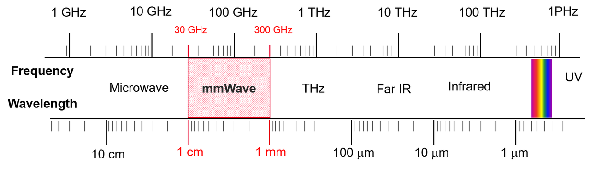

# 60GHz_mmWave
This is a demo repository for a 60 GHz mmWave Communication testbed. The testbed uses PlutoSDR to generate IF signals for 60 GHz link.
To control the image size in your README file on GitHub, you can use HTML within the Markdown file. Here's how you can update your README to include an image with controlled size:

```markdown
# GNURadio Project

This repository contains the steps and scripts to set up and conduct KPI measurements over 60 GHz using GNURadio, Eder software, and MATLAB.

## Table of Contents

- [Installation](#installation)
- [Setup](#setup)
- [Running the Sessions](#running-the-sessions)
- [MATLAB Python Engine Setup](#matlab-python-engine-setup)
- [Conducting KPI Measurements](#conducting-kpi-measurements)
- [Contributing](#contributing)
- [License](#license)

## Installation

### Step 1: Install Eder Software

1. Download the Eder software from the official website or repository.
2. Follow the installation instructions provided in the Eder software documentation.

```sh
# Example command (update according to actual installation steps)
install_eder_software.sh
```

## Setup

### Step 2: Arrange Eder B Folder for Tx and Rx Sessions

1. Create a directory structure for the Tx and Rx sessions.
2. Place the relevant Eder B configuration files and scripts into their respective directories.

```sh
# Example directory structure
mkdir -p eder/Tx eder/Rx
cp /path/to/tx_files/* eder/Tx/
cp /path/to/rx_files/* eder/Rx/
```

## Running the Sessions

### Step 3: Launch Two PowerShell Sessions from a Single Python File

Create a Python script to launch two PowerShell windows, one for the Tx session and one for the Rx session.

```python
import subprocess

# Command to launch PowerShell for Tx session
subprocess.Popen(["powershell", "-NoExit", "-Command", "Start-Process powershell -ArgumentList 'cd eder/Tx; ./start_tx_session.ps1'"])

# Command to launch PowerShell for Rx session
subprocess.Popen(["powershell", "-NoExit", "-Command", "Start-Process powershell -ArgumentList 'cd eder/Rx; ./start_rx_session.ps1'"])
```

### Step 4: Open Tx EVK Session and Rx EVK Session

Execute the PowerShell scripts to open the Tx and Rx EVK sessions.

```powershell
# Tx EVK Session
cd eder/Tx
./start_tx_session.ps1

# Rx EVK Session
cd eder/Rx
./start_rx_session.ps1
```

## MATLAB Python Engine Setup

### Step 5: Arrange MATLAB Python Engine and Set Path

1. Install the MATLAB Engine API for Python.

```sh
# Example command
pip install matlab
```

2. Set up the MATLAB engine in your Python environment and configure the path.

```python
import matlab.engine

# Start MATLAB engine
eng = matlab.engine.start_matlab()

# Set path for MATLAB scripts
eng.addpath(r'C:\path\to\your\matlab\scripts')
```

## Conducting KPI Measurements

### Step 6: Conduct KPI Measurements Over 60 GHz

1. Use the configured Tx and Rx sessions to perform KPI measurements.
2. Iterate through each Tx beam and Rx beam combination to collect data.

```python
# Example code to conduct measurements
for tx_beam in range(num_tx_beams):
    for rx_beam in range(num_rx_beams):
        # Set Tx and Rx beams
        eng.set_tx_beam(tx_beam)
        eng.set_rx_beam(rx_beam)
        
        # Conduct measurement
        kpi_result = eng.measure_kpi()
        
        # Save or process result
        save_kpi_result(tx_beam, rx_beam, kpi_result)
```

<p align="center">
  
</p>

## Contributing

Feel free to submit issues or pull requests if you find any bugs or have suggestions for improvements.

## License

This project is licensed under the MIT License - see the [LICENSE](LICENSE) file for details.
```

In the code above, the image is wrapped in an HTML `<p>` tag with `align="center"` to center it and the `` tag includes a `width` attribute to control the size. Adjust the `width` value as needed to fit your requirements. Make sure the image file `kpi_measurement_diagram.png` is placed in the `images` directory within your repository.
